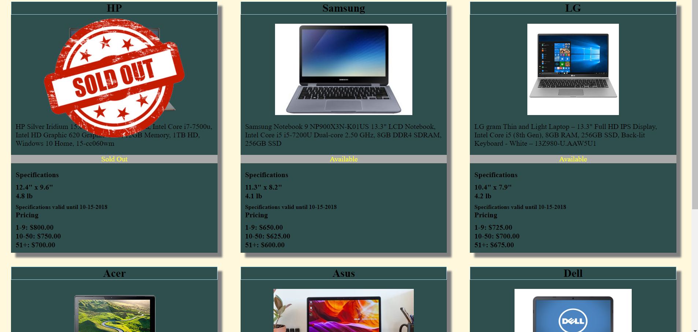

# Product Cards

This project is an expploration of basic html and css using js to write data to the DOM.

## Screenshots


## How to run this project
* Use npm to install http-server in your terminal:
```sh
npm install -g http-server
```
* Run the server
```sh
hs -p 9999
```
* Open chrome and navigate to:
```
localhost:9999
```